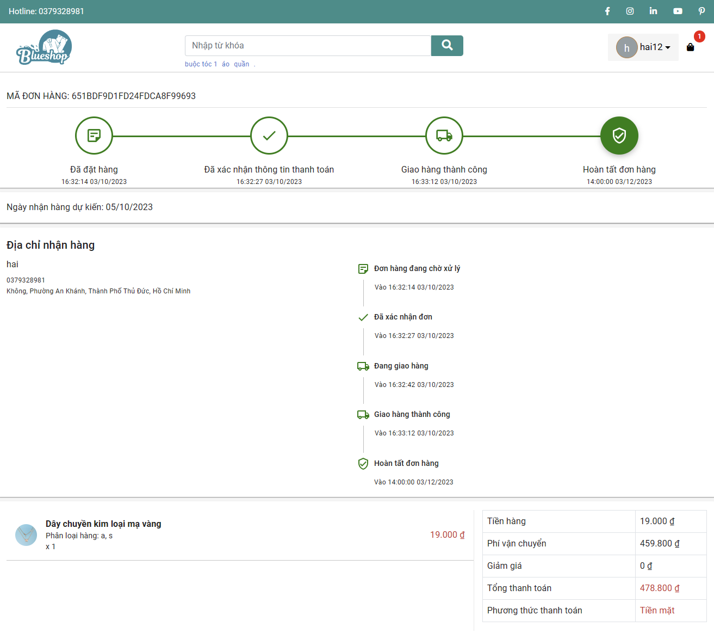

# BlueShop
BlueShop is a fashion e-commerce website, developed using the MERN stack.

## Technologies
- MongoDB
- Express.js
- Node.js
- React
- Cloudinary
- Giaohangnhanh API
- Momo Wallet

## Architecture

## Demo
BlueShop is already deployed, with the backend hosted on Render and the frontend on Vercel. Explore this website using the following accounts:

|          |       Client (User)    | Management (Admin) |
| :------: | :--------------------: | :-------------------: | 
|    URL   | [shop-frontend-user.vercel.app](https://shop-frontend-user.vercel.app/) | [shop-frontend-admin.vercel.app](https://shop-frontend-admin.vercel.app/) |
|   Email  | `nthai2001cr@gmail.com` | `mochacr0@gmail.com` |
| Password |        `String1`        |       `String1`      |
> [!NOTE]
> Please be patient during the initial load, as the free hosting plan may cause some delay.

## Screenshots
**Admin dashboard**

**Product management**

**Homepage**

**Product searching**

**Product details**

**Place order**

**Order history**

